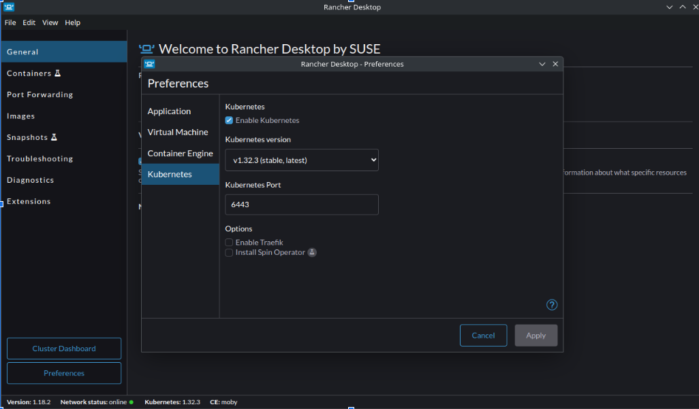
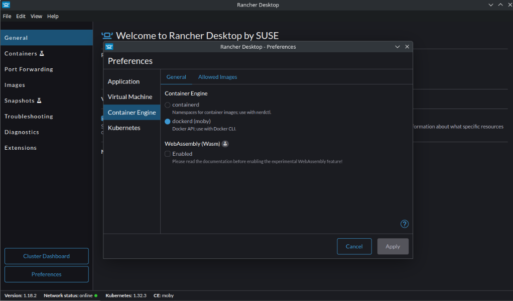
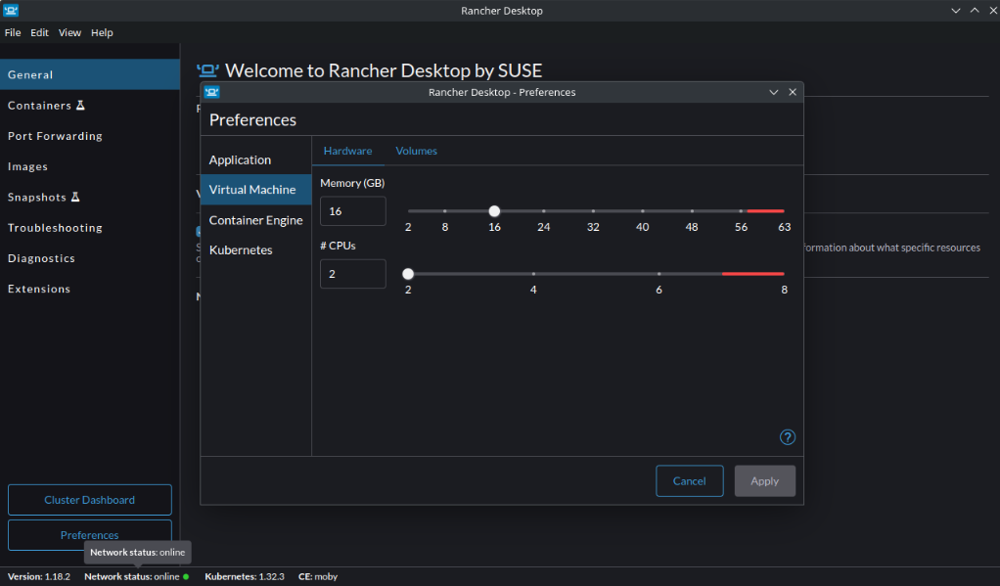
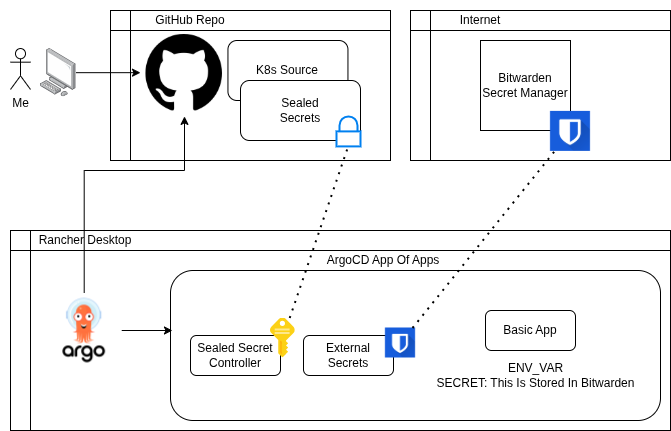

<br />

Setting Up a Local Kubernetes Lab
I decided to build a new local Kubernetes lab.
In the past, I’ve experimented with different providers—Minikube, KIND, and K3s—running both locally and on Raspberry Pi devices. I like trying new tools and tech, so I was on the lookout for a clean and simple way to get a lab up and running. I had a few core requirements:

* Portable: I wanted the cluster to work anywhere.


* Simple: I’ve built "Kubernetes the Hard Way" before—this time I wanted something easier.


* Persistent: KIND doesn't always recover well after my laptop sleeps or reboots.


After some research and a few YouTube rabbit holes, I landed on Rancher Desktop.

I’d used Rancher Desktop before, mostly for Docker, but I hadn’t taken full advantage of the built-in Kubernetes (K3s). It also comes with native support for Traefik, which is a bonus.

### Installation

Installation was easy. The docs were clear, and Rancher supports Windows, macOS, and Linux. I’m on Fedora KDE, and they support dnf, so I had it installed and running in minutes.

Docs: [Rancher Desktop Installation Guide](https://docs.rancherdesktop.io/getting-started/installation/)

In the preferences panel, I was able to:

Choose the Kubernetes version:



Select between dockerd and containerd:



Set CPU and memory limits:



Sometimes, less really is more.

### Lab Architecture

This isn’t a home server setup—just a local lab. 

My goals:

* Test Kubernetes tools with minimal overhead

* Use GitOps for configuration and deployments

* Keep code in a public GitHub repo

* Avoid the cloud (no GCP, AWS, Azure)


Even though the cluster is local and not exposed externally, I still want to follow best practices—especially around secret management.

Requirements:

* GitOps: I’m using ArgoCD. It’s solid, visual, and gets the job done.


* Public: All my code lives in a public GitHub repo.


* Simple: I want to pass a variable to an app via a secrets manager.


* Secure: Secrets come from Bitwarden, using External Secrets.





I chose Bitwarden Secrets Manager because it’s free and integrates with External Secrets. That covers most of my security concerns, but the initial Bitwarden config still needs protection.
I tried SOPS with age, but it didn’t go smoothly. 

Then I found Sealed Secrets from Bitnami.

_“Problem: I can manage all my K8s config in git—except Secrets.”
 “Solution: Encrypt your Secret into a SealedSecret, which is safe to store—even in a public repo.”_

This was exactly what I needed.
The Sealed Secrets controller handles encryption/decryption. Only the controller can decrypt the secrets—nobody else, not even me. That’s fine, since I don’t need to decrypt them locally.

Here’s how to use it:

Step 1: Create the secret:

```
kubectl create secret generic bitwarden-access-token -n external-secrets \
  --from-literal=token=156f0558548518180f216.d5TcgcMXP7KSteSLi6Cgciwf7rMTaA:F25gDaR7xuf7sZIsQJ5mrQ== \
  --dry-run=client -o yaml > secret-bitwarden-token.yaml
```

Step 2: Seal the secret:

```
kubeseal --controller-name sealed-secrets -f secret-bitwarden-token.yaml > sealed-secret-bitwarden-token.yaml 
```

This sealed version is safe to commit to GitHub.

### Application Secret Injection

With Bitwarden configured and sealed, I can now have External Secrets inject variables into my app:

```apiVersion: external-secrets.io/v1beta1
kind: ClusterSecretStore
metadata:
  name: bitwarden-secretsmanager
spec:
  provider:
    bitwardensecretsmanager:
      apiURL: https://api.bitwarden.com
      identityURL: https://identity.bitwarden.com
      auth:
        secretRef:
          credentials:
            key: token
            name: bitwarden-access-token
            namespace: external-secrets
      bitwardenServerSDKURL:  https://bitwarden-sdk-server.external-secrets.svc.cluster.local:9998
      organizationID: a3223df9-320f-476d-ae6c-b2ba00541773 
      projectID: f9f974eb-d57d-4afb-a4c0-b2c8014a05d7

```

```
apiVersion: external-secrets.io/v1beta1
kind: ExternalSecret
metadata:
  name: bitwarden
spec:
  refreshInterval: 1h
  secretStoreRef:
    name: bitwarden-secretsmanager
    kind: ClusterSecretStore
  data:
  - secretKey: test
    remoteRef:
      key: "68695b57-b879-4ab3-b2ab-b2c8014d038b"  # This is the key in bitwarden that pulls the value
```


```
env:
  - name: APP_MESSAGE
    value: "Test Application"
  - name: SECRET
    valueFrom:
      secretKeyRef:
        name: bitwarden
        key: test
```

### Round Up

* Decided on Rancher Desktop with K3s for simplicity and portability

* Set up GitOps using ArgoCD

* Chose Bitwarden Secrets Manager for managing secrets

* Used Sealed Secrets to securely store secrets in a public repo

* Connected it all with External Secrets to inject secrets into my apps

* This setup gives me a lightweight, local, Kubernetes lab with best practices baked in.
