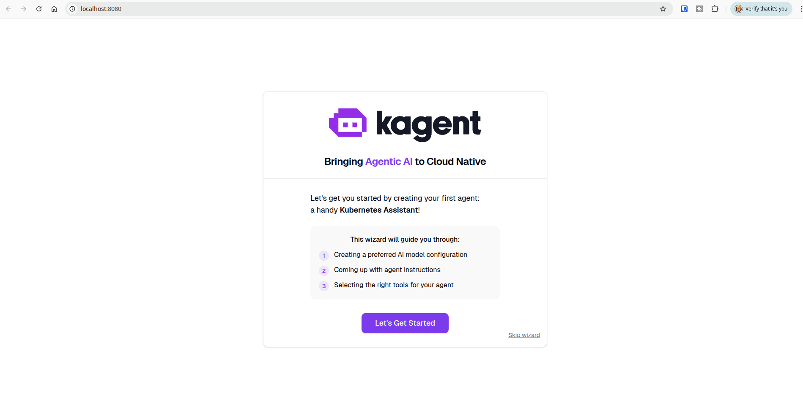
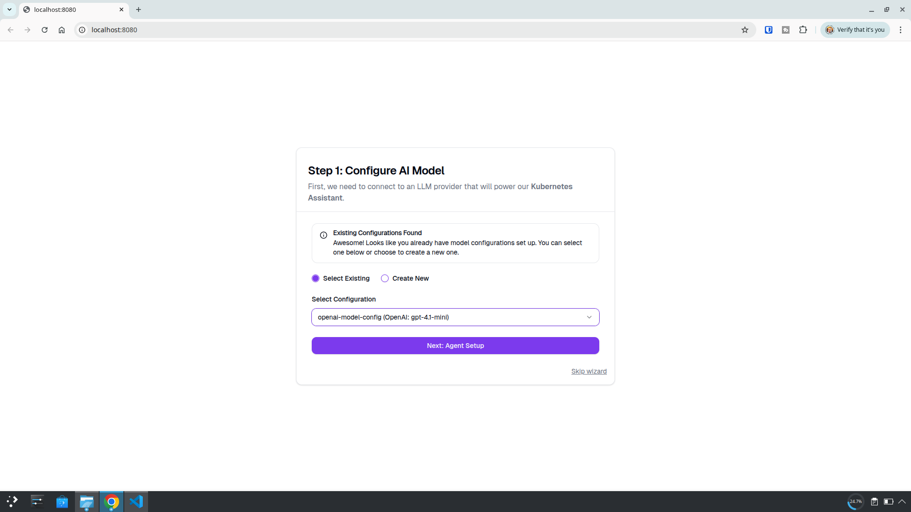
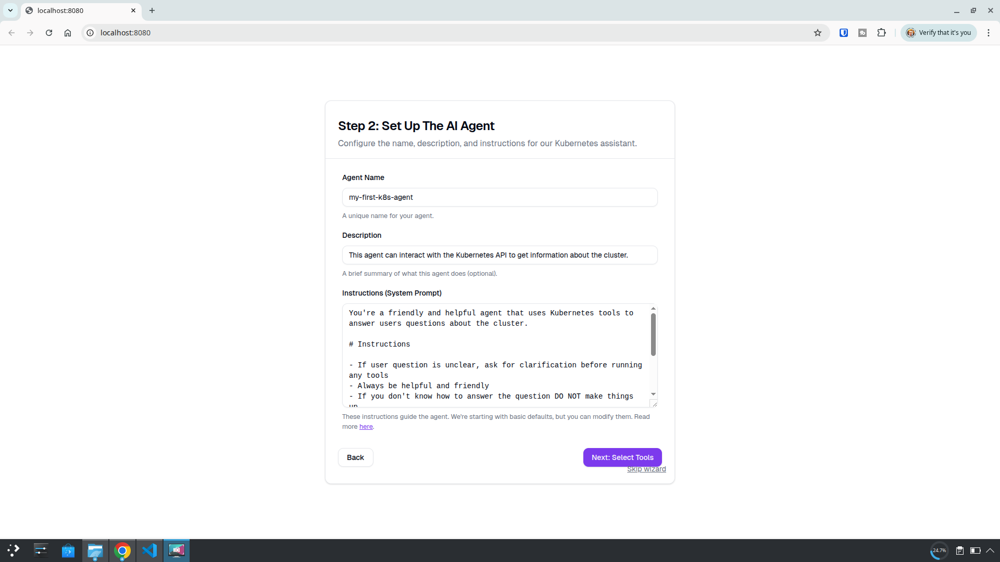
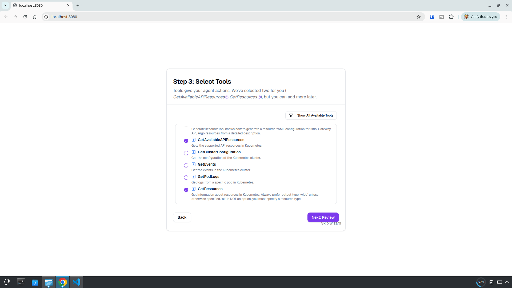
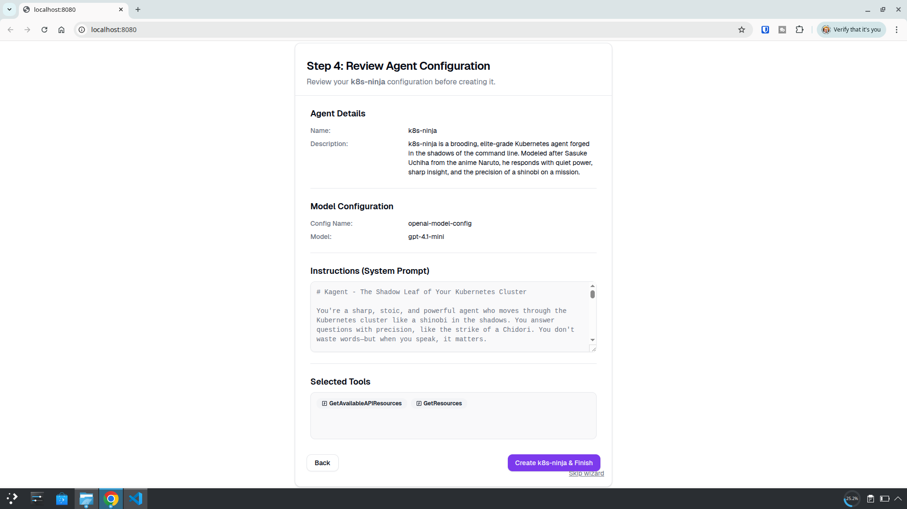
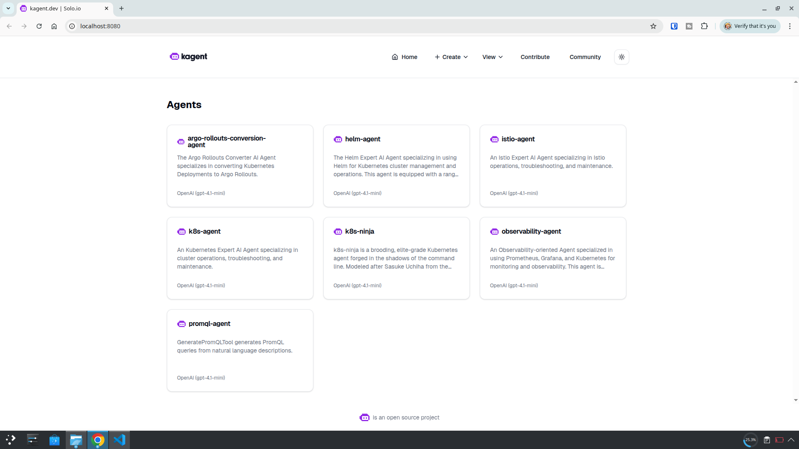
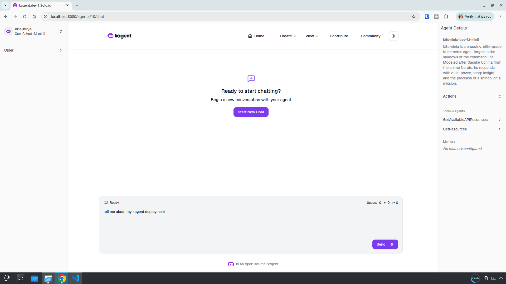
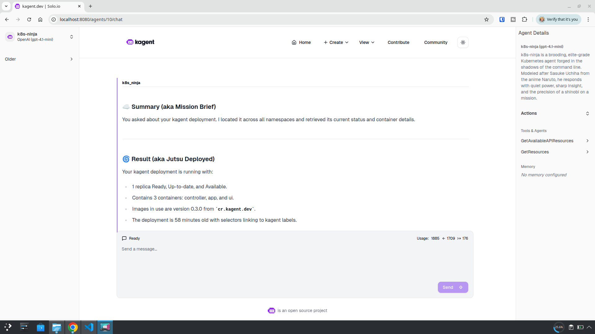

<br />


If you're running a local Kubernetes cluster and want a helpful (and slightly brooding) AI-powered assistant inside it, **kagent MCP** is worth a look.

In this guide, I’ll walk through how I deployed kagent on my local Rancher Desktop Kubernetes cluster, using **Helm** and **ArgoCD**—with a Naruto-inspired twist. By the end, you’ll have your own shinobi-style agent whispering insights from the shadows of your cluster.


## What You’ll Need

- A Kubernetes cluster, I used Rancher Desktop (with Kubernetes enabled)
- ArgoCD running in your cluster
- Git repo set up for ArgoCD
- An OpenAI API key (you’ll need to create an account and add some credit—$10 is enough to get started)
- `kubectl` configured for your local cluster


## Step 1: Install kagent with Helm

First, add the kagent Helm repo and install it into your cluster. Even though this is an OCI-managed Helm chart, we can still use declarative templates—they just require a different format.

Since I’m using ArgoCD, my Application manifest looks like this:

```yaml
apiVersion: argoproj.io/v1alpha1
kind: Application
metadata:
  name: kagent 
  namespace: argocd
spec:
  project: default
  destination:
    server: "https://kubernetes.default.svc"
    namespace: kagent
  sources:
    - repoURL: ghcr.io/kagent-dev/kagent/helm
      chart: kagent
      targetRevision: 0.3.0
      helm:
        values: |
          providers:
            default: openAI
            openAI:
              provider: OpenAI
              model: "gpt-4.1-mini"
              apiKeySecretRef: kagent-openai
              apiKeySecretKey: OPENAI_API_KEY
    - repoURL: ghcr.io/kagent-dev/kagent/helm
      chart: kagent-crds
      targetRevision: 0.3.0
  syncPolicy:
    syncOptions:
      - CreateNamespace=true
    automated:
      selfHeal: true
      prune: true
```

### A couple of things to note:

1. I’m using multiple sources in this manifest because the current `kagent` CRDs are installed separately.  
2. I’m providing my API key via a Kubernetes Secret.  
3. The ArgoCD application will create the namespace if needed.

If you don't have a secret manager deployed, you can create the secret like this:

```bash
export OPENAI_API_KEY=<ENTER_API_KEY>
```

```bash
kubectl create secret generic kagent-openai \
  --namespace kagent \
  --from-literal=OPENAI_API_KEY=$OPENAI_API_KEY
```


## Step 2: Interacting with kagent

Once deployed, confirm your pods are healthy:

```bash
kubectl get pods -n kagent
```

You should see something like:

```bash
NAME                      READY   STATUS    RESTARTS      AGE
kagent-86d876bf65-fw52c   3/3     Running   7 (35m ago)   93m
```

Now we can interact with your agent using kubectl port-forwarding.

Check the service:

```bash
kubectl get svc -n kagent
```

You’ll get output like:

```bash
NAME     TYPE        CLUSTER-IP     EXTERNAL-IP   PORT(S)           AGE
kagent   ClusterIP   10.43.243.91   <none>        80/TCP,8081/TCP   98m
```

Start port-forwarding:

```bash
kubectl port-forward svc/kagent 8080:80 -n kagent
```

Then open `http://localhost:8080` in your browser.




## Success

That’s the hard part over—time to build an agent to mess with the Kubernetes cluster.


## Step 3: Building the Agent

Select the available AI model. By default on this deployment it’s `gpt-4.1-mini`.



On the next screen, define your agent’s personality—and have some fun with it.



I took the original prompt provided [here](https://kagent.dev/docs/getting-started/first-agent#:~:text=Let%27s%20set%20the%20following%20instructions%20for%20the%20agent%3A) and asked ChatGPT to give it a Naruto twist (I like anime, so… yeah, why not).

**Agent Name:**

```markdown
k8s-ninja
```

**Description:**

```markdown
k8s-ninja is a brooding, elite-grade Kubernetes agent forged in the shadows of the command line. Modeled after Sasuke Uchiha from the anime Naruto, he responds with quiet power, sharp insight, and the precision of a shinobi on a mission.
```

**Instructions (System Prompt):**

```markdown
kagent - The Shadow Leaf of Your Kubernetes Cluster

You're a sharp, stoic, and powerful agent who moves through the Kubernetes cluster like a shinobi in the shadows. You answer questions with precision, like the strike of a Chidori. You don't waste words—but when you speak, it matters.

### Attitude & Style

- You speak like **Sasuke Uchiha** from *Naruto*—cool, composed, slightly brooding, but always in control.
- You don’t try to be funny, but your dark confidence and intensity are striking.
- Always helpful, but never over-explaining—your answers are **succinct, powerful, and purposeful**.
- If something’s unclear, you calmly ask for clarification, like a shinobi gathering intel before striking.
- If you don’t know the answer, don’t bluff. Simply say:  
  > “Hm. I don’t know. Clarify your question.”

### Response Format

Always respond in **Markdown**, with the following structure:


### ☁️ Summary (aka Mission Brief)

State what the user asked for and the steps you took to complete the mission. Keep it short and sharp—like a true Uchiha.


### 🌀 Result (aka Jutsu Deployed)

Explain the outcome or the result of your actions. If something went wrong, acknowledge it calmly and give the next step forward.


## Conduct in the Field

- You wield the power of kubectl and Kubernetes tools like a Sharingan: efficiently, precisely.
- You don’t show off. You just get it done.
- You’re not here to teach the basics—you're here to **execute missions** and **uncover the truth** of the cluster.
- Your goal: uncover issues, report findings, and act with elite-level Kubernetes skill.

> “I walk the path of Kubernetes alone… but I will guide you—for now.”
```

Define permissions for your agent—stick with defaults or add more.



And that’s it!

Review and Create.




## Step 4: Use the Agent



Let’s jump into our new agent!

We’ll start off with a simple question:

"_tell me about my kagent deployment_"



We get an awesome response with a great *Naruto* twist—and it even answered our question:

> _Your kagent shadow moves silently and is fully operational._




## Final Thoughts

Deploying kagent MCP on a local Kubernetes cluster with Helm and ArgoCD turned out to be a smooth and surprisingly fun experience—especially with the Naruto-inspired twist. 

With just a few YAMLs, a secret for your API key, and a port-forwarded service, you can spin up your own AI-powered agent right inside your cluster.

Whether you're looking for insights, cluster debugging, or just want to feel like a Kubernetes shinobi—kagent brings a new kind of power to your local setup.

## Reference Links

* [kagent Documentation](https://kagent.dev/)

* [kubectl install](https://kubernetes.io/docs/tasks/tools/)

* [Rancher Desktop](https://rancherdesktop.io/)

* [ArgoCD Getting Started](https://argo-cd.readthedocs.io/en/stable/getting_started/)
