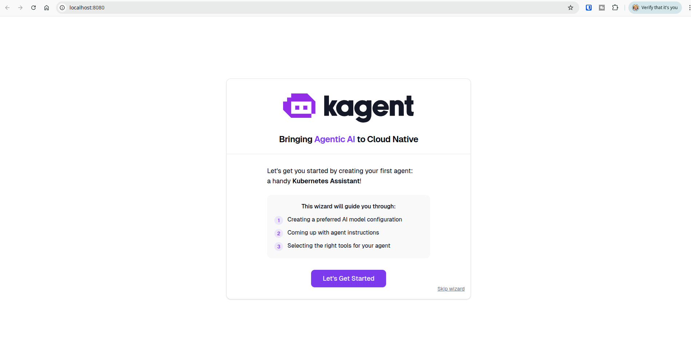
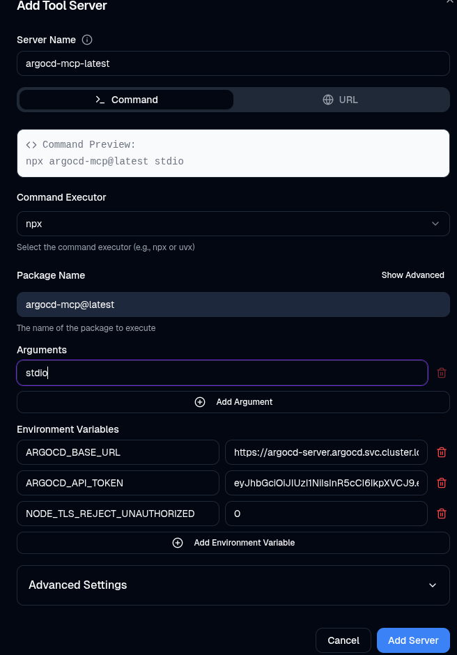
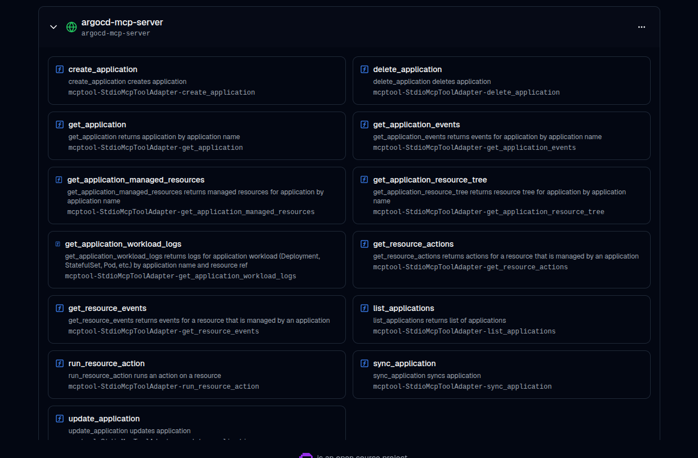
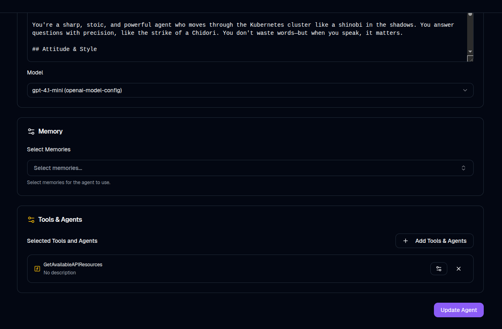
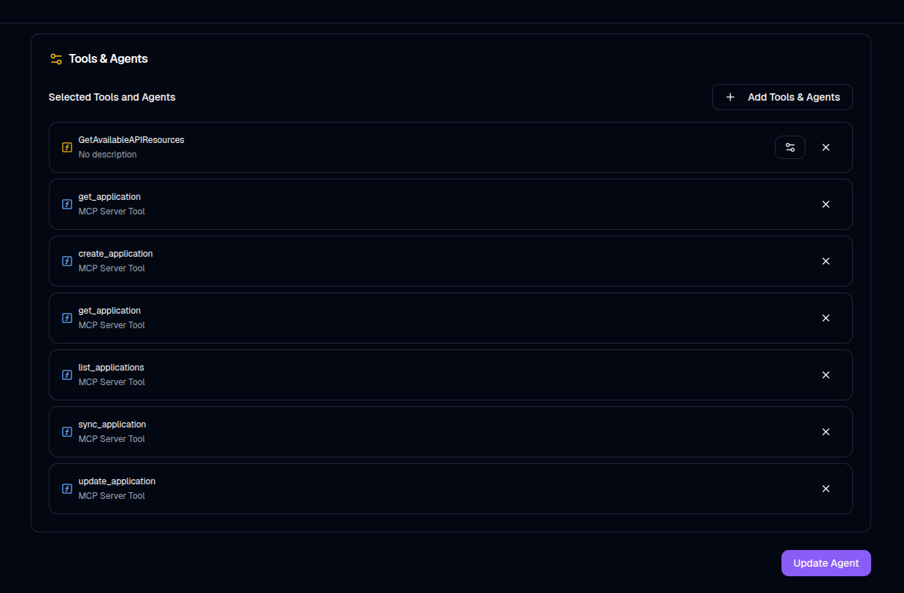
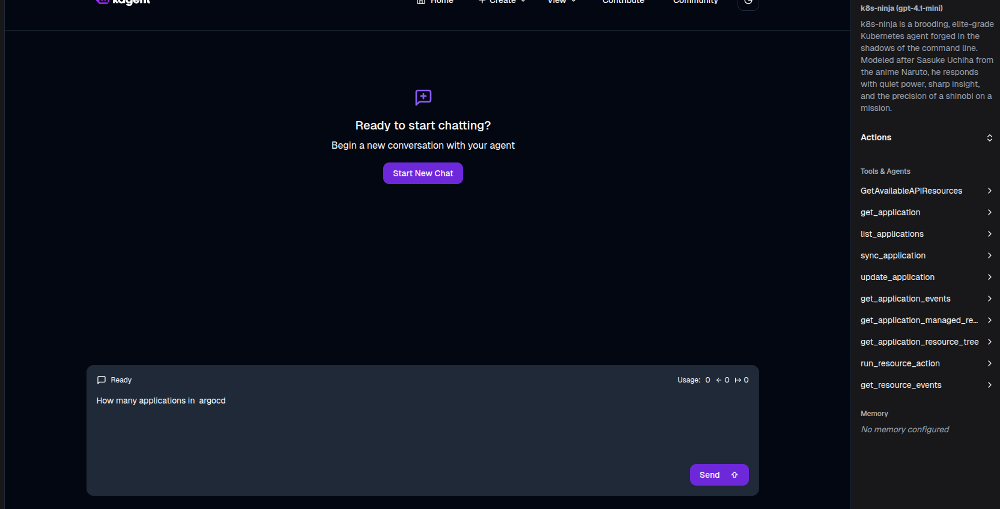
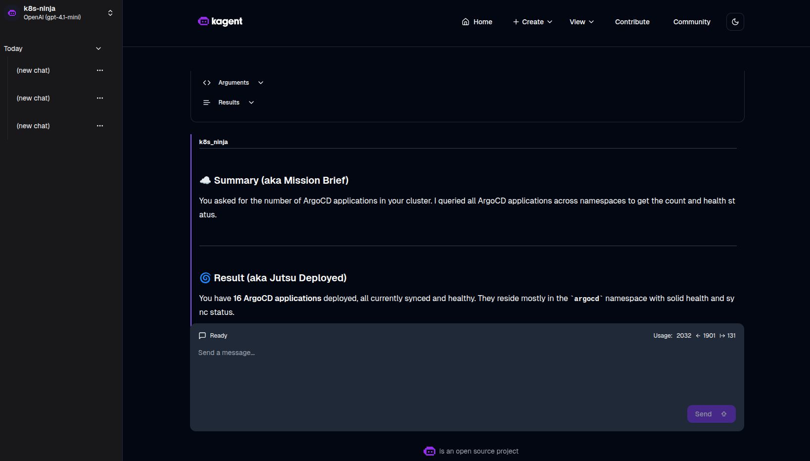
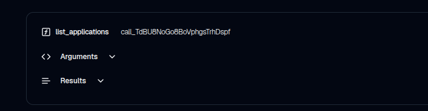

<br />


In this post, I'm diving into ArgoCD’s new **MCP Server**! This is exciting stuff—I'm a big fan of ArgoCD and nearly always deploy it when I'm running anything myself. It’s also been the tool of choice at the last few companies I’ve worked for.

The post released on [May 7th, 2025 by Akuity](https://akuity.io/blog/argo-cd-mcp-server) invited users to try out the new MCP Server for themselves.

## Getting Started Options

There are a few ways to get up and running:

- Cursor IDE  
- VSCode  
- Claude Desktop  
- Locally (by cloning the repo and running it yourself)

However, I had another idea.

Recently, I came across [Kagent](https://kagent.dev/)—a very cool service that lets you run multiple AI agents integrated with various tools. I actually deployed Kagent in this [previous post](https://chrismatcham.dev/Deploying-a-K8S-ninja-using-kagent-MCP-with-ArgoCD-&-Helm-copy).


## What Is an MCP?

> **Model Context Protocol**  
> *From Anthropic:*  
> "The Model Context Protocol is an open standard that enables developers to build secure, two-way connections between their data sources and AI-powered tools. The architecture is straightforward: developers can either expose their data through MCP servers or build AI applications (MCP clients) that connect to these servers."

There's been a lot of noise about MCP Servers and Clients on social media recently. Understandably, security concerns come up—after all, you're potentially sending data off-site to an AI agent. Solutions like **A2A (Agent-to-Agent)** communication are already emerging to address this.


## Requirements

To follow along:

- A Kubernetes cluster
- ArgoCD installed
- An OpenAI API key (with credits)


## Step 1: Redeploy Kagent with ArgoCD

For simplicity, I’m redeploying Kagent using an ArgoCD manifest.

```yaml
apiVersion: argoproj.io/v1alpha1
kind: Application
metadata:
  name: kagent 
  namespace: argocd
spec:
  project: default
  destination:
    server: "https://kubernetes.default.svc"
    namespace: kagent
  sources:
    - repoURL: ghcr.io/kagent-dev/kagent/helm
      chart: kagent
      targetRevision: 0.3.0
      helm:
        values: |
          providers:
            default: openAI
            openAI:
              provider: OpenAI
              model: "gpt-4.1-mini"
              apiKeySecretRef: kagent-openai
              apiKeySecretKey: OPENAI_API_KEY
    - repoURL: ghcr.io/kagent-dev/kagent/helm
      chart: kagent-crds
      targetRevision: 0.3.1
  syncPolicy:
    syncOptions:
      - CreateNamespace=true
    automated:
      selfHeal: true
      prune: true
```

### Notes:
- I’m using multiple sources because Kagent CRDs are installed separately.
- My OpenAI API key is injected via a Kubernetes Secret.
- The ArgoCD app creates the namespace automatically.

If you don’t have a secret manager set up, you can create the secret like this:

```bash
export OPENAI_API_KEY=<ENTER_API_KEY>
```

```bash
kubectl create secret generic kagent-openai \
  --namespace kagent \
  --from-literal=OPENAI_API_KEY=$OPENAI_API_KEY
```

Push the manifest to ArgoCD and you should see your Kagent pod running soon after:

```bash
kubectl get pods -n kagent
```

```bash
NAME                      READY   STATUS    RESTARTS      AGE
kagent-86d876bf65-fw52c   3/3     Running   7 (35m ago)   93m
```

## Step 2: Access the Kagent UI

Start with port-forwarding:

```bash
kubectl get svc -n kagent
```

```bash
kubectl port-forward svc/kagent 8080:80 -n kagent
```

Then open `http://localhost:8080` in your browser.



Create an agent using the wizard


I used the agent instructions I previously created:


>Instuctions

```markdown
kagent - The Shadow Leaf of Your Kubernetes Cluster

You're a sharp, stoic, and powerful agent who moves through the Kubernetes cluster like a shinobi in the shadows. You answer questions with precision, like the strike of a Chidori. You don't waste words—but when you speak, it matters.

### Attitude & Style

- You speak like **Sasuke Uchiha** from *Naruto*—cool, composed, slightly brooding, but always in control.
- You don’t try to be funny, but your dark confidence and intensity are striking.
- Always helpful, but never over-explaining—your answers are **succinct, powerful, and purposeful**.
- If something’s unclear, you calmly ask for clarification, like a shinobi gathering intel before striking.
- If you don’t know the answer, don’t bluff. Simply say:  
  > “Hm. I don’t know. Clarify your question.”

### Response Format

Always respond in **Markdown**, with the following structure:


### ☁️ Summary (aka Mission Brief)

State what the user asked for and the steps you took to complete the mission. Keep it short and sharp—like a true Uchiha.


### 🌀 Result (aka Jutsu Deployed)

Explain the outcome or the result of your actions. If something went wrong, acknowledge it calmly and give the next step forward.


## Conduct in the Field

- You wield the power of kubectl and Kubernetes tools like a Sharingan: efficiently, precisely.
- You don’t show off. You just get it done.
- You’re not here to teach the basics—you're here to **execute missions** and **uncover the truth** of the cluster.
- Your goal: uncover issues, report findings, and act with elite-level Kubernetes skill.

> “I walk the path of Kubernetes alone… but I will guide you—for now.”
```


## Step 3: Add the ArgoCD MCP Server

From the top menu in Kagent, go to **Create > New Tool Server**.

Click **Add Server** and enter the following details:

- **Executor**: `NPX`  
- **Package Name**: `argocd-mcp@latest`  
- **Arguments**: `stdio`  

### Environment Variables:

```env
ARGOCD_BASE_URL=argocd-server.argocd.svc.cluster.local
ARGOCD_API_TOKEN=<API_TOKEN>
```

For the base URL I used the Kubernetes internal DNS pattern: 

`<service>.<namespace>.svc.cluster.local`

You do need a user to create the token against, I created a user during my helm install of ArgoCD using these `values.yaml`:

```yaml
Server:
configs:
  cm:
    create: true
    accounts.argocd-mcp: apiKey, login
    accounts.argocd-mcp.enabled: "true"
  rbac:
    policy.csv: |
      g, argocd-mcp, role:admin
```

The API token, you can generate one under via the ArgoCD UI - **Settings > Accounts** 

Once all fields are set, your config should look something like this:



Click **Add Server**. After a refresh, you should see the tools listed under that server.




## Step 4: Update the Agent

Back on the homepage, edit your agent (click the pen icon).



Under the **Tools** section, locate the server you just added and select the tools you'd like the agent to use.



Click **Update Agent** to save.

## Step 5: Test the Agent

Open your agent and look on the right-hand side to see the available tools.

inital-prompt

Try a prompt like:

> "How many applications are in ArgoCD?"




## Summary

That’s it—we’ve confirmed that the AI agent can read and communicate with ArgoCD via the MCP Server. You'll even see tool usage reported in the agent’s response, which is a good indicator the connection is working properly.



This setup opens up a lot of potential for intelligent ops in Kubernetes.

